<p align="center">
  <h1 align="center">⚡ Quick Codex</h1>
  <p align="center">
    <strong>Workflow durability for Codex CLI.<br>Resume cleanly. Plan with evidence. Execute without losing the thread.</strong>
  </p>
  <p align="center">
    <a href="https://www.npmjs.com/package/quick-codex"></a>
    
    
    <a href="https://www.npmjs.com/package/quick-codex"></a>
    
    
  </p>
  <p align="center">
    <a href="#the-problem">The Problem</a> ·
    <a href="#how-it-works">How It Works</a> ·
    <a href="#demo">Demo</a> ·
    <a href="#quick-start">Quick Start</a> ·
    <a href="#which-skill-to-use">Which Skill</a> ·
    <a href="#benchmarks">Benchmarks</a> ·
    <a href="#cli">CLI</a>
  </p>
</p>

---

## The Problem

Codex is strong at focused execution. It weakens when the task outlives a single session.

```
Without Quick Codex                    With Quick Codex
─────────────────────────────          ─────────────────────────────────────
Turn 1  clarify the task               Turn 1  create run artifact: goal,
Turn 2  start researching                      affected area, risks, plan
Turn 3  begin implementation           Turn 2  execute one verified wave
Turn 6  context crowded, session       Turn 3  checkpoint → deliberate
        compacts at wrong moment               carry-forward handoff
Turn 7  next step unclear,             Turn 6  resume from file state,
        thread is lost                         not from stale chat memory
```

**The core pain points Quick Codex addresses:**

| Pain point | Without | With Quick Codex |
|---|---|---|
| Codex keeps losing the thread | Plan lives in chat only | Persistent run artifact: gate, phase, wave, blockers |
| Can't resume after interruption | Reconstruct state by hand | `quick-codex resume` — one command, one pasteable prompt |
| Execution drifts mid-task | Agent guesses the next step | `qc-lock` strict loop: preflight → plan → lock → execute → verify → fix |
| Gray areas silently ignored | Agent picks a path and keeps going | Hard stop until each gray area resolves or is explicitly deferred |
| Context loss at compaction | Transcript dragged forward wastefully | Deliberate carry-forward with scoped keep/drop cues |

---

## How It Works

Quick Codex installs two skills into Codex's skill directory:

```
YOUR TASK
  │
  ├─ qc-flow   ──→  discuss → affected area → research → gray area register
  │                 → delivery roadmap → verified plan → execute waves
  │                 → checkpoint with carry-forward handoff
  │                        │
  │                        ▼ (when scope is fully understood)
  └─ qc-lock   ──→  preflight → plan → lock → execute → verify → fix
                    (strict loop, no drift, file-state first)
```

**State lives in files, not chat:**

```
.quick-codex-flow/
  STATE.md              ← active run pointer
  <run>.md              ← full artifact: goal, plan, waves, ledger, handoff
  PROJECT-ROADMAP.md    ← milestone and cross-run dependency state
  BACKLOG.md            ← parked work, deferred decisions, future seeds
```

**Six continuity layers** keep work resumable across sessions:

| Layer | What it preserves |
|---|---|
| C1 Baseline | Goal, required outcomes, affected area, out-of-scope boundaries |
| C2 State | Current gate, phase, wave, execution mode, blockers |
| C3 Resume | Next safe command, next verify, compact-safe handoff |
| C4 Risk | Session risk, burn risk, approval strategy |
| C5 Experience | Hook-derived warnings, active constraints, invariants |
| C6 Proof | Verification ledger, requirements still satisfied |

---

## Demo

### 1 — Resume after interruption



Recover the active run, next gate, and exact prompt to paste — from local file state, not chat memory.

---

### 2 — qc-flow: plan a non-trivial task



Clarify → surface affected area → clear gray areas → build a delivery roadmap with a verified phase plan.

---

### 3 — qc-lock: strict execution with verification



Preflight → lock → execute one step → verify output → done. No drift, no guessing.

---

## Quick Start

### Install from npm

```bash
npx quick-codex install
```

Installs `qc-flow` and `qc-lock` into `~/.agents/skills`. Restart Codex.

### Use it

For non-trivial tasks (unclear scope, multi-turn, research needed):

```text
Use $qc-flow for this task: <your task here>
```

For tightly scoped execution (known scope, strict verification needed):

```text
Use $qc-lock for this task: <your task here>
```

### Scaffold a project

```bash
quick-codex init --dir ./my-project
```

Creates `STATE.md`, `PROJECT-ROADMAP.md`, `BACKLOG.md`, and a sample run artifact.

### Check your active run

```bash
quick-codex status --dir ./my-project
quick-codex resume --dir ./my-project
```

### Other install options

<details>
<summary>Local checkout / dev symlinks</summary>

```bash
# Local checkout via npx
npx --yes ./quick-codex install

# Direct CLI
node bin/quick-codex.js install

# Dev symlinks
mkdir -p ~/.agents/skills
ln -s /path/to/repo/qc-flow ~/.agents/skills/qc-flow
ln -s /path/to/repo/qc-lock ~/.agents/skills/qc-lock
```

</details>

---

## Which Skill to Use

| Situation | Use | Why |
|---|---|---|
| Requirements unclear, scope unknown | `qc-flow` | Clarifies, surfaces affected area, researches, then executes |
| Bug fix with known scope | `qc-lock` | Stays close to preflight → verify → fix |
| Small refactor, known files | `qc-lock` | Keeps scope narrow, verifies each step |
| Task spans multiple turns | `qc-flow` | Persistent artifacts survive session resets |
| Already have a `qc-flow` run in progress | `qc-flow` | Resume from artifact, don't switch midstream |
| `qc-flow` done, only execution left | `qc-lock` | Hand off to strict executor once front-half is complete |

**When to switch from `qc-flow` to `qc-lock`:**
- Clarify, affected-area discussion, research, and plan-check are done
- Scope is narrow enough for locked step-by-step execution
- No active gray-area triggers remain

---

## Benchmarks

Quick Codex is judged on workflow reliability, not feature count. Each proof scenario runs the same task with and without Quick Codex.

| Benchmark | What it proves |
|---|---|
| [Resume After Interruption](./BENCHMARK-PROOF.md) | Recovers active run, next gate, and next prompt from local state — not chat memory |
| [Verification Thrash](./BENCHMARK-PROOF-THRASH.md) | Real fail → narrow → fix loop instead of broad blind retries |
| [Scope Drift](./BENCHMARK-PROOF-DRIFT.md) | Explicit artifacts and locked execution reduce mid-task drift |
| [Failure Recovery](./BENCHMARK-PROOF-FAILURE.md) | Recovery behavior when the workflow is partial or awkward |
| [Carry-Forward Footprint](./BENCHMARK-PROOF-CARRY-FORWARD.md) | Same-phase next-wave pack is materially smaller than the full artifact |
| [Brain-Advised Session Action](./BENCHMARK-PROOF-BRAIN-SESSION-ACTION.md) | Protocol works alone; sharper when Experience Engine adds a guarded verdict |
| [Workflow Hardening](./BENCHMARK-PROOF-WORKFLOW-HARDENING.md) | Forces affected-area discussion, evidence-based planning, and `qc-lock` preflight |
| [Compaction Modes](./BENCHMARK-PROOF-COMPACTION-MODES.md) | `compact` vs `clear` vs `relock` checkpoint decisions are explicit, not implicit |

Full benchmark index: [BENCHMARKS.md](./BENCHMARKS.md)

---

## OpenAI Native Integration

Quick Codex ships `openai.yaml` agent configs so Codex can discover and invoke the skills natively:

```yaml
# qc-flow/agents/openai.yaml
interface:
  display_name: "Quick Codex Flow"
  short_description: "Clarify, research, plan, then execute"
  default_prompt: "Use $qc-flow to clarify this task, verify context sufficiency,
    build a checked phase-and-wave plan, then execute it sequentially."
policy:
  allow_implicit_invocation: true
```

Skills are discovered from `~/.agents/skills` (canonical) or `~/.codex/skills` (legacy).

---

## Experience Engine Integration

Quick Codex works standalone. It becomes sharper when paired with [Experience Engine](https://github.com/muonroi/experience-engine).

**Division of responsibility:**

| Layer | Owner |
|---|---|
| Protocol baseline: phase relation, compaction action, safety guardrails | Quick Codex |
| Advisor layer: hook warnings, brain verdict, model-choice routing | Experience Engine |

**Sync hook warnings into an active run:**

```bash
# From recent hook text
quick-codex capture-hooks --dir ./my-project --input ./hooks.txt

# From a concrete next tool action
quick-codex sync-experience --dir ./my-project --tool Write \
  --tool-input '{"file_path":"src/app.ts"}'
```

Active warnings survive resume and compaction via `Experience Snapshot` in the run artifact. See [CONTINUITY-CONTRACT.md](./CONTINUITY-CONTRACT.md) for the full field ownership spec.

---

## CLI Reference

```bash
# Install / upgrade / uninstall
quick-codex install [--copy] [--target <dir>]
quick-codex upgrade [--copy] [--target <dir>]
quick-codex uninstall [--target <dir>] [--dir <project-dir>]

# Project setup
quick-codex init [--dir <project-dir>] [--force]
quick-codex doctor [--target <dir>]

# Active run — status and resume
quick-codex status [--dir <project-dir>] [--run <path>]
quick-codex resume [--dir <project-dir>] [--run <path>]
quick-codex project-status [--dir <project-dir>]
quick-codex snapshot [--dir <project-dir>] [--run <path>]

# Execution and verification
quick-codex verify-wave [--dir <project-dir>] [--run <path>] [--phase <id>] [--wave <id>]
quick-codex regression-check [--dir <project-dir>] [--run <path>] [--phase <id>] [--wave <id>]
quick-codex close-wave [--dir <project-dir>] [--run <path>] [--phase <id>] [--wave <id>] [--phase-done]
quick-codex lock-check [--dir <project-dir>] [--run <path>]

# Repair and validate
quick-codex repair-run [--dir <project-dir>] [--run <path>]
quick-codex doctor-run [--dir <project-dir>] [--run <path>]
quick-codex doctor-flow [--dir <project-dir>] [--run <path>]
quick-codex doctor-project [--dir <project-dir>]

# Delegation (role-split workflows)
quick-codex delegate-research [--dir <project-dir>] [--run <path>] [--question <text>]
quick-codex delegate-plan-check [--dir <project-dir>] [--run <path>] [--focus <text>]
quick-codex delegate-goal-audit [--dir <project-dir>] [--run <path>] [--focus <text>]
quick-codex complete-delegation [--dir <project-dir>] [--run <path>] --type <research|plan-check|goal-audit>

# Experience Engine sync
quick-codex capture-hooks [--dir <project-dir>] [--run <path>] [--input <path>]
quick-codex sync-experience [--dir <project-dir>] [--run <path>] --tool <name>

# Project sync
quick-codex sync-project [--dir <project-dir>] [--run <path>]
```

Full usage notes: [QUICKSTART.md](./QUICKSTART.md) · [EXAMPLES.md](./EXAMPLES.md) · [TASK-SELECTION.md](./TASK-SELECTION.md)

---

## Known Limits

Quick Codex improves workflow discipline around Codex. It does not change Codex core behavior.

**Reduces:**
- Context drift across turns
- Vague handoffs between planning and execution
- Execution thrash on longer tasks

**Does not fix:**
- Native Codex hangs or long internal wait states
- Quota or usage opacity
- Platform-level approval bugs
- Model-level compaction bugs

The package is a workflow layer. It helps work survive platform failures — it does not remove them.

---

## Contributing

- Read [CONTRIBUTING.md](./CONTRIBUTING.md)
- Validate with `bash scripts/lint-skills.sh`
- Test a real task with artifacts, not only the docs

---

## Troubleshooting

<details>
<summary>Install / upgrade issues</summary>

- `npx quick-codex install` fails → wait for npm propagation or use `npx --yes ./quick-codex install`
- Update available → `npx quick-codex@latest upgrade`
- npm cache not writable → `npm_config_cache=/tmp/qc-cache npx quick-codex install`
- Codex does not see the skills → check `~/.agents/skills`, restart Codex

</details>

<details>
<summary>Run artifact issues</summary>

- `doctor-run` says stale → `quick-codex repair-run --dir ./my-project`
- `lock-check` not lock-ready → make affected area, exclusions, evidence basis, and verify path explicit; remove active gray-area triggers
- `verify-wave` cannot find verify commands → add `Verify:` bullets to `Current Execution Wave`
- `close-wave` refuses → run `verify-wave` first, clear failing ledger entries

</details>

<details>
<summary>General</summary>

- Unsure which skill → start with `qc-flow`, switch to `qc-lock` when scope is locked
- Validate the package → `node bin/quick-codex.js doctor`
- `init` should not overwrite my AGENTS.md → it writes `AGENTS.quick-codex-snippet.md` when AGENTS.md already exists

</details>

---

<p align="center">
  <sub>MIT License · Built for <a href="https://github.com/openai/codex">Codex CLI</a> · Node 18+</sub>
</p>
